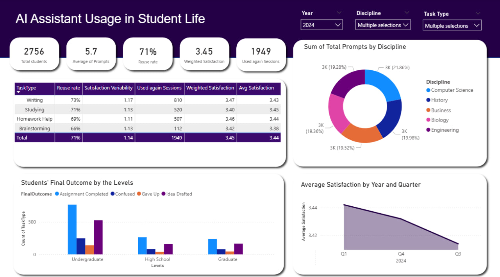

# AI Assistant Usage in Student Life 📊

This project analyzes how students use AI assistants in their academic life.  
The dashboard was created in **Power BI** and includes KPIs, slicers, and interactive visuals.  

## 🔍 Dashboard Preview

## 📊 Dashboard Overview
This Power BI dashboard explores **AI Assistant Usage in Student Life**, showing how students from different disciplines interact with AI tools.  

- **KPIs at the top** highlight total students, usage patterns, and satisfaction levels.  
- **Interactive slicers (Year, Discipline, Task Type)** allow users to filter the data easily.  
- **Discipline-wise analysis** shows balanced usage across Computer Science, Biology, Engineering, History, and Business, Math, Psychology.
- **Task type breakdown** (writing, studying, research, homework help, coding, brainstorming) provides insights into where AI is most reused.  
- **Student outcomes by level** (high school, undergraduate, graduate) reveal how engagement varies by academic stage.  
- **Satisfaction trends** over time indicate a gradual decline, showing opportunities for improvement.  

### 📝 Notes
- This dashboard was designed as part of my **Data Analytics portfolio**.  
- Tools used: **Power BI, DAX, Data Modeling**.  
