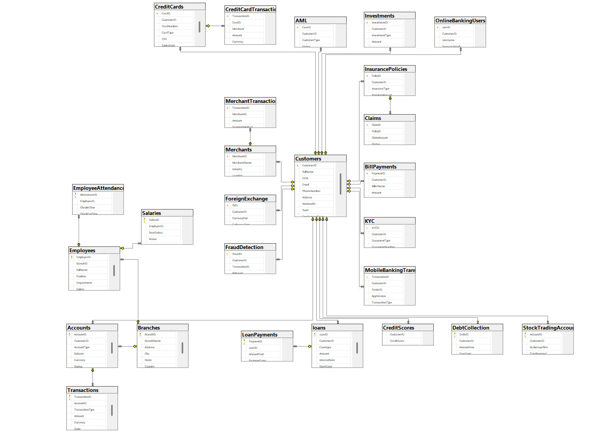

# 🏦 Banking System — Excel to SQL Server ETL

This project demonstrates how to **ingest Excel data into SQL Server** for a Banking System database with 30 tables that are related to banking system.
It showcases **ETL pipeline design, schema mapping, and automated bulk loading and random data generation** using Python!

## 📸 Database Schema

## ⚙️ Features
- Reads multiple Excel sheets (30 tables)  
- Validates **primary keys and data types**  
- Loads in correct **referential order** (parents → children)  
- Config-driven design → easy to extend to more tables  

## 🛠 Tools Used
- **Python** → ETL pipeline and random data generation 
- **SQL Server** → database  
- **Excel (CSV/XLSX)** → input data  

