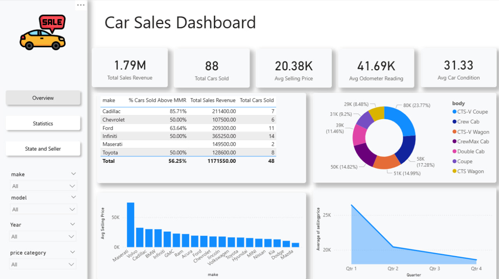
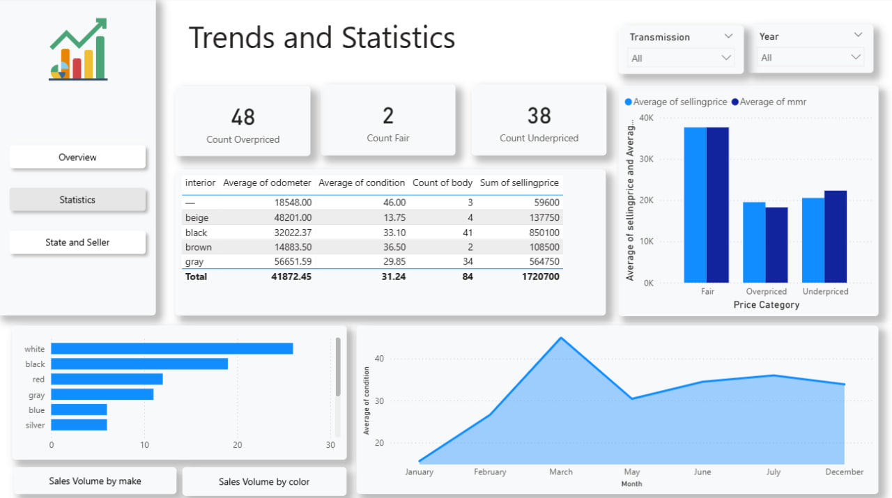
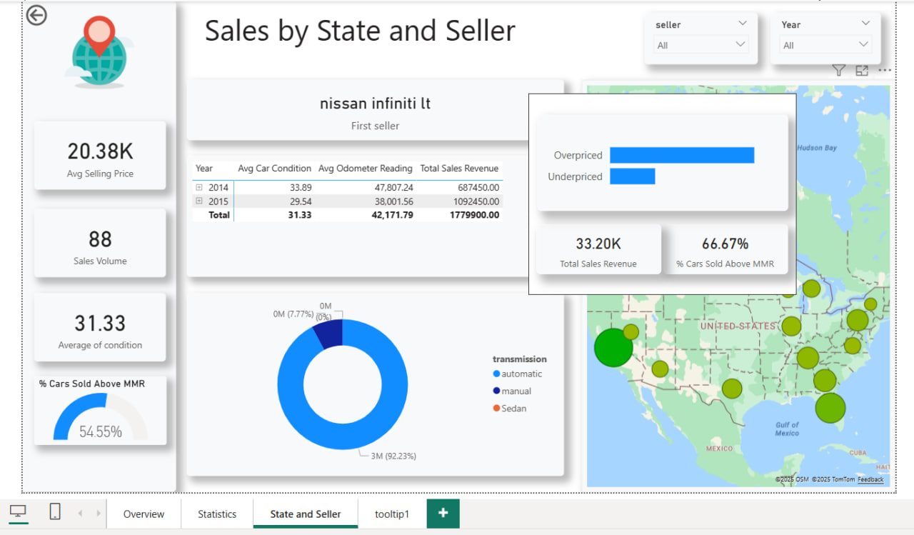

# 🚗 Car Sales Dashboard — Power BI

This Power BI project analyzes **car sales performance** with a focus on pricing, condition, sellers, and geography.  
The dashboard provides insights into sales volume, average selling price, over/under-priced cars, dealer performance and other information related to car sales.

## 📊 Dashboard Pages

### 1. Overview
- Main KPIs: Total sales, average odometer, average condition, average selling price, total sold cars.
- Cars categorized by **price (fair, overpriced, underpriced)**.  
- Sales breakdown by **make** and **color**.  
- Trend of sales volume over time.  

### 2. Statistics
- main KPIs: count of overpriced, underpriced and fair cars 
- average of car condition over months.
- sales volume by make and color using bookmark
- Distribution by **transmission type**.  
- % of cars sold above/below Market MMR benchmark.  

### 3. Sales by State & Seller
- Dealer-level analysis with KPIs - average selling price, sales volume, average of condition, % cars sold above MMR with slicers of the year and seller.  
- Sales mapped by **state and seller location**.  
- Toolkit for more information in the map that describes statistics of each state 
- Distribution of transmission with donut chart  

## 🚀 Features
- **Interactive slicers**: filter by year, seller, state.  
- **Geographic map**: visualize sales distribution across the U.S.  
- **KPI cards**: track average selling price, sales volume, and condition.  
- **Comparisons**: cars above vs. below market reference (MMR).  

## 🔍 Insights
- Over **66% of cars were sold above MMR value**.  
- Sedans and automatic transmissions make up the largest sales share.  
- Certain states and sellers dominate total sales revenue.  
- Sales trends highlight peak months and seasonal variations.  

## 📸 Preview

## 🛠 Tools Used
- **Power BI**: Data modeling, DAX, visualization.    

## 📌 Notes
This project is part of my **Data Analytics portfolio** and demonstrates skills in:
- Power BI dashboard design  
- KPI tracking and reporting  
- Data storytelling and visualization  
